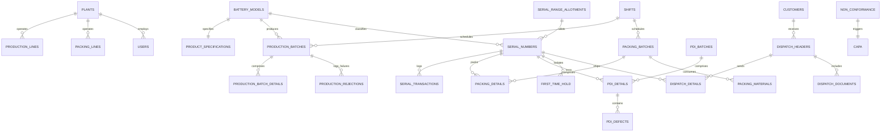

# SNMS ERP v2.0 (Serial Number Management System)
## Lead Acid Battery Manufacturing - PostgreSQL Enterprise Database Manual
**Author:** Senior ERP Solution Architect & Lead PostgreSQL Database Administrator  
**Database Release Compatibility:** PostgreSQL 16+ / Neon Serverless Postgres

---

## 1. Enterprise System Architecture

The SNMS ERP v2.0 database is designed as a high-throughput, ACID-compliant ledger for tracking and validating millions of individual Lead Acid battery components throughout their physical lifecycle.

### 1.1 Architectural Characteristics
- **3NF Normalization:** Zero update anomalies on master specs, lines, routes, or logistic documents.
- **Micro-movement Tracking:** Immutability on physical serial transformations; movements generate autonomous historic ledger rows instantly.
- **Automated Caching:** Built-in dynamic summaries and real-time balance metrics that protect write workloads from heavy analytical locks.
- **Relational Integrity:** Strong CHECK domains preventing improper OCV (Open Circuit Voltage), high-temperature curing, or incorrect electrolyte specific gravity inputs.

---

## 2. Mermaid ER Diagram & Relationships



---

## 3. Physical Database Mapping

### 3.1 Primary & Foreign Keys Architecture
- **Primary Keys:** Standardized on `BIGSERIAL` (64-bit auto-incrementing integers) across all transactional ledgers to support billions of rows without overflow risks. `UUID v4` keys are utilized exclusively for session isolation (`user_sessions`).
- **Foreign Keys:** Enforced with explicit constraint handlers:
  - `ON DELETE CASCADE` is applied to sub-details (e.g., `packing_details`, `pdi_defects`, `capa` logs) to prevent orphaned children during maintenance.
  - `ON DELETE SET NULL` is applied to operational/user fields (e.g., `scanned_by`, `checked_by`) to preserve physical inventory transaction history even if an employee account is deleted.

### 3.2 Dynamic Data Flow Map
```
[ALLOTMENT RANGE] --(bulk_allocate)--> [SERIAL RECORDS (Allocated)]
                                               |
                                        (Casting & Pasting)
                                               |
                                               v
[PRODUCTION BATCH] ------------> [SERIAL RECORDS (Production)]
                                               |
                                         (Plate Curing)
                                               |
                                               v
[PACKING BATCH] ---------------> [SERIAL RECORDS (Packing)]
                                               |
                                       (OCV & IR Testing)
                                               |
                                               v
[PDI BATCH] -------------------> [SERIAL RECORDS (PDI Approved)]  ---(Failure)---> [FIRST TIME HOLD (Hold)]
                                               |                                           |
                                         (Final Checks)                             (CAPA Corrective Run)
                                               |                                           |
                                               v                                           v
[DISPATCH HEADER] -------------> [SERIAL RECORDS (Dispatched)]  <-------------------(Release Safe)
```

---

## 4. Indexing & Query Strategy

Optimizing performance for active production sites tracking 10M+ serial records is resolved via a tiered indexing plan:

### 4.1 B-Tree Index Strategy
- `idx_serials_number_hash` on `serial_numbers(serial_number)`: Guarantees sub-millisecond lookups during handheld terminal barcoding/scanning actions.
- `idx_serials_prefix_running` on `serial_numbers(model_id, year_code, month_code, running_number)`: Optimizes query sorting during range checks and sequential batch trace queries.

### 4.2 Partial & Sparse Index Strategy
Since only ~0.1% of manufactured batteries face defects, full-table scanning is prevented via partial indexes:
- `idx_serials_active_holds`: `CREATE INDEX ON serial_numbers(plant_id) WHERE current_status = 'Hold';`
- `idx_serials_active_rejected`: `CREATE INDEX ON serial_numbers(plant_id) WHERE current_status = 'Rejected';`

### 4.3 JSONB GIN Index Strategy
- `idx_serial_history_jsonb` on `serial_history USING gin (historical_data_json)`: Speeds up deep historical investigation queries conducted by quality auditors on structured log packets.

---

## 5. Partitioning Strategy

For high-volume production deployments exceeding 50 million records, the `serial_transactions` and `audit_logs` tables must be partitioned to prevent index bloat and manage active disk pages.

### 5.1 Range Partitioning by Month
```sql
-- Architectural Blueprint for Partitioning Transaction Logs
CREATE TABLE serial_transactions_partitioned (
    transaction_id BIGINT NOT NULL,
    serial_id BIGINT NOT NULL,
    transaction_type transaction_type_enum NOT NULL,
    created_at TIMESTAMP WITH TIME ZONE DEFAULT CURRENT_TIMESTAMP NOT NULL,
    -- other columns ...
    PRIMARY KEY (transaction_id, created_at)
) PARTITION BY RANGE (created_at);

-- Generate monthly partitions dynamically
CREATE TABLE serial_transactions_y2026m07 PARTITION OF serial_transactions_partitioned
    FOR VALUES FROM ('2026-07-01 00:00:00+00') TO ('2026-08-01 00:00:00+00');
```
*Why this is crucial:* It enables **Partition-Pruning** (PostgreSQL immediately discards scanning unreferenced months) and facilitates instantaneous archiving by simply dropping or detaching legacy monthly partition slices.

---

## 6. Enterprise Security and Audit Policies

### 6.1 Row Level Security (RLS)
Ensure multi-plant isolation where operators can only read/edit records from their designated primary manufacturing facility:
```sql
ALTER TABLE serial_numbers ENABLE ROW LEVEL SECURITY;

CREATE POLICY plant_isolation_policy ON serial_numbers
    FOR ALL
    TO authenticated_users
    USING (plant_id = (SELECT primary_plant_id FROM users WHERE email = CURRENT_USER));
```

### 6.2 Data Masking & Sanitization
`user_credentials` table uses a dedicated trigger (`process_audit_logging_fn`) to scrub security credentials. The system automatically strips `password_hash` and `salt` objects before casting them into the GIN-indexed `audit_logs` dataset to ensure strict GDPR/SOC2 compliance.

---

## 7. Cloud-Native Scaling & Backup Strategies

### 7.1 Neon Serverless Integration
- **Scale-to-Zero Auto Scaling:** Since warehouse dispatches and heavy battery forming actions occur primarily during plant shift hours, Neon can auto-suspend during idle night hours to reduce cloud compute costs.
- **Copy-on-Write Branching:** Instantaneously branch your active 1TB production dataset into isolated QA/Development workspaces in 2 seconds to safely run load-testing or schema migrations.

### 7.2 Core Backup Rules
1. **Continuous WAL Archiving (PITR):** Enforce Point-In-Time Recovery to allow the manufacturing system to roll back to any microsecond within the previous 30 days. This protects the plant database against accidental batch corruptions.
2. **Weekly Cold Dumps:** Automated hourly cron outputs using `pg_dump` targeting secondary cold storage (Amazon S3 / Google Cloud Storage) with standard encryption keys.
